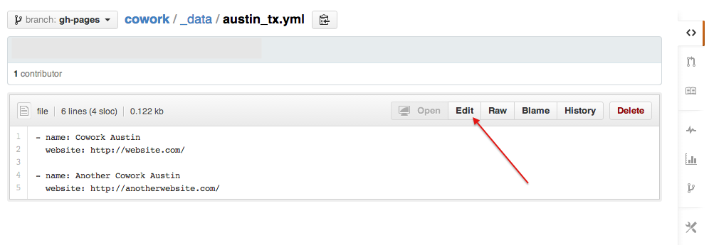

#Instructions for Contributors

##Registering on GitHub and "Forking the Repository"

Register for a [GitHub](http://github.com) account.

Login to GitHub, then go to a [The Master Cowork Website](http://github.com/coworkingdotcom/cowork), and create a copy of the website by "Forking the Repository".

Once you have your own version of the website, you can go to http://YOURUSERNAME.github.com/cowork. If this is your first time "Forking the Repository", it may take up to 10 minutes for the website to appear.

##Adding a New City, plus Cowork Locations

Once you have forked the master Cowork Website. Click on the \_data folder.

The files in this directory represent all cowork locations in each city. If your city is not represented, click the "+" button to add a new file. If your city is already in the list of files, you can skip this section.

Enter a file name in the form of CITY\_STATEABBR.yml. Fill out the file, and the press the "Commit New File" button. _The order of the cowork locations do not matter. When they are displayed on the website, they will be randomized_.

Once you have commited your city file along with cowork locations, go to up one directory and click the \_cities.yml file.

Click the edit button to edit the \_cities.yml file.

Add your city information to the bottom. Order doesn't matter, the website will list the locations in alphabetical order (State, City).

Once you have added your city information. You can then go to http://YOURURSERNAME.github.com/cowork, to see your city. If you are happy with your changes, go to the "Submit a Pull Request" section.

##Editing Cowork Locations for an Existing City

Click on the \_data folder.

Click on your the city you want to edit.

Click the edit button to edit the file.

Update the values and commit your changes.

##Submit a Pull Request

Once you are happy with your changes, you can then submit a "pull request" to the Master Cowork Website. Navigate to the home page of your fork by clicking the repository name.

On the homepage, click then "Compare and Review" button.

You'll be taken to a page to review the changes you've made.  If you are happy with the changes. Click the "Click to create a pull request for this comparison" link.

You're done! The owner of the Master Cowork Website will review the changes and either accept or reject the pull request. If your pull request is accepted, the changes will show up on the main site.
